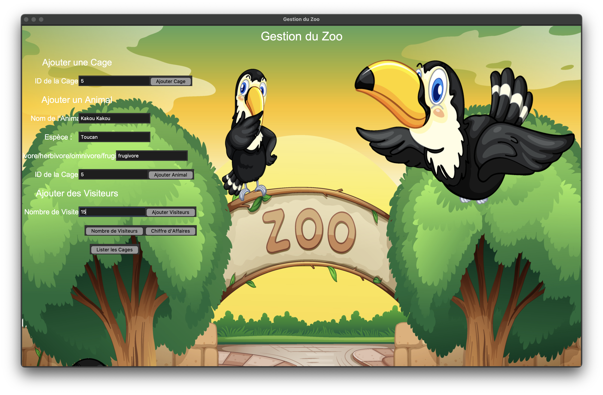

---
# 🦁 Gestion du Zoo

Une application interactive pour gérer un zoo à l'aide d'une interface graphique basée sur **Tkinter**. Ce projet permet de gérer:
  - Les **cages** et les animaux qui y vivent.
  - Les **visiteurs** avec un suivi du chiffre d'affaires.
  - Une interface intuitive pour ajouter, afficher et gérer les données du zoo.
---

## 📸 Aperçu de l'application

Voici une capture d'écran de l'interface graphique :



---

## 🛠️ Fonctionnalités

### Gestion des cages

- Ajouter une nouvelle cage en saisissant son ID.
- Afficher toutes les cages avec leurs animaux respectifs.

### Gestion des animaux

- Ajouter un animal en précisant :
  - Son nom.
  - Son espèce.
  - Son régime alimentaire (carnivore, herbivore, omnivore, frugivore).
  - L'ID de la cage où il sera placé.

### Gestion des visiteurs

- Ajouter un nombre de visiteurs.
- Calculer automatiquement le chiffre d'affaires (5 € par visiteur).
- Afficher le nombre total de visiteurs et le chiffre d'affaires.

### Interface intuitive

- Une interface graphique conviviale avec des champs de saisie et des boutons interactifs.

---

## 🛑 Prérequis

1. Python 3.8 ou supérieur.
2. **Pillow** pour la gestion des images :
   ```bash
   pip install pillow
   ```

---

## 🚀 Installation et utilisation

### Étapes pour exécuter le projet :

1. Clonez ce dépôt :

   ```bash
   git clone <URL_DU_DEPOT>
   cd zoo
   ```

2. Créez un environnement virtuel et activez-le :

   ```bash
   python3 -m venv .venv
   source .venv/bin/activate  # Sur Windows : .venv\Scripts\activate
   ```

3. Installez les dépendances :

   ```bash
   pip install -r requirements.txt
   ```

4. Exécutez l'application :
   ```bash
   python main.py
   ```

---

## 📂 Structure du projet

```
zoo/
├── main.py                # Fichier principal pour lancer l'application
├── components/            # Gestion des données métier (Zoo, Cage, Animal, etc.)
│   ├── __init__.py
│   ├── zoo.py
│   ├── cage.py
│   ├── animal.py
│   ├── visiteur.py
├── controllers/           # Gestion de la logique métier
│   ├── __init__.py
│   ├── zoo_controller.py
├── views/                 # Interface graphique Tkinter
│   ├── __init__.py
│   ├── zoo_view.py
├── img/                   # Ressources graphiques
│   ├── 35637.jpg          # Image de fond
│   ├── Capture d’écran 2024-11-15 à 10.39.51.png  # Vue de l'application
├── .venv/                 # Environnement virtuel (ajouté à .gitignore)
└── README.md              # Documentation du projet
```

---

## 🔧 Améliorations possibles

1. **Gestion avancée des animaux** :

   - Gestion des relations prédateur/proie.
   - Alimentation des animaux en fonction de leur régime alimentaire.

2. **Gestion des visiteurs** :

   - Différenciation entre visiteurs adultes et enfants (tarifs différents).
   - Historique des visiteurs.

3. **Améliorations de l'interface** :
   - Boutons plus interactifs.
   - Statistiques sur le zoo (par exemple : nombre total d'animaux par espèce).

---

## 🤝 Contribuer

Les contributions sont les bienvenues ! Si vous souhaitez apporter des modifications :

1. Forkez ce dépôt.
2. Créez une branche pour vos modifications :
   ```bash
   git checkout -b feature/ma-nouvelle-fonctionnalite
   ```
3. Soumettez une Pull Request.

---

## 📄 Licence

Ce projet est sous licence MIT. Voir le fichier [LICENSE](LICENSE) pour plus d'informations.

---
